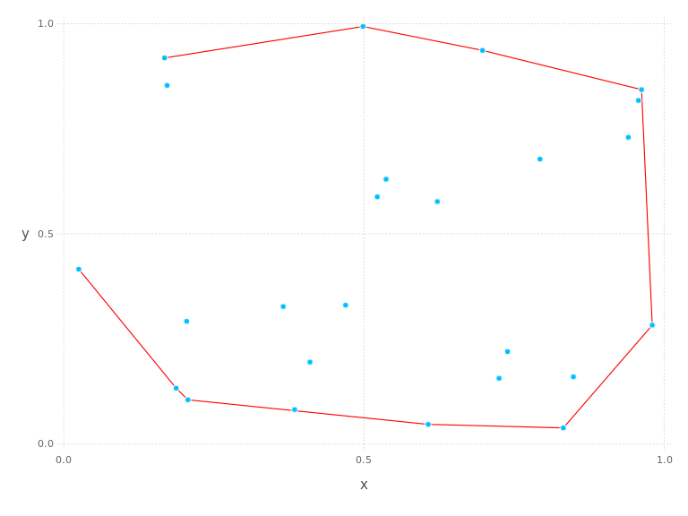

# The QuickHull package

QuickHull is a naïve implementation of the [QuickHull][wiki] algorithm for
calculating the convex hull of a set of points in 2D.



## Usage

The algorithm works with `Vec{2}`s from [FixedSizeArrays][fsa], so you can pass
a vector of such points directly to the algorithm:

```@example
using FixedSizeArrays
points = map(Vec, rand(25), rand(25))

using QuickHull
hull = qhull(points)
```

The points are returned in order, starting with the leftmost point and moving
counter-clockwise around convex hull.

You can also just pass two arrays of equal length containing the ``x``
and ``y`` values of your points, and `qhull` will figure it out:

```@example
xs, ys = rand(25), rand(25)

using QuickHull
xhull, yhull = qhull(xs, ys)
```

As you notice, the format of the return values matches that of the input.

[wiki]: https://en.wikipedia.org/wiki/Quickhull
[fsa]: https://github.com/SimonDanisch/FixedSizeArrays.jl